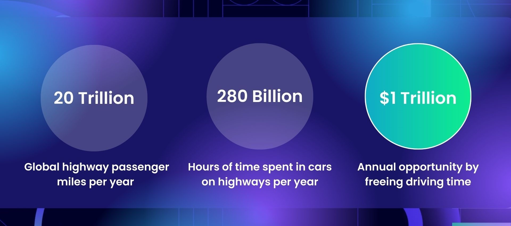

# Autoware - Low Speed Autonomy Vehicles
The repo describes the goal, use case, and design of low speed autonomy vehicles using Autoware.

To learn more about how to participate in this project, please read the [onboarding guide](/ONBOARDING.md)

## Value Proposition

(From PoV) It is estimated that over **20 Trillion** passenger miles are driven on highways around the world, each year. 

 

## Limitations of Existing Technologies

### Obstacle Perception Challenge

### Driving Corridor Perception Challenge

## High Definition Maps
(From PoV) **We will not utilize 3D high definition prior maps**, instead opting to use existing 2D navigational (sat-nav style) maps, also called ADAS maps. Human beings can drive on highways without prior knowledge of the detailed 3D geometry of roadways by relying on real-time scene perception, and our system aims to mimic this process.

## End-to-End AI Architecture
(From PoV) We will follow an **End-to-End AI Architecture** in which each component technology of the highway pilot system is powered through neural-networks. We will follow a modular AI approach with component AI systems allowing for system explainability, introspection, verification and safety validation.

## Technology Roadmap

### Goal
(From PoV) We will aim to develop true hands-off, eyes-off autonomous driving which is enabled on highways across the world, this will be classified as SAE Level-4 autonomy, where no human supervision is required of the vehicle.

### Technology Release Cycle
(From PoV) We will iteratively and sequentially build the core software stack of the highway pilot system in a modular manner, and release versions of the autonomous highway pilot system that serve a core customer need, where each new release expands upon the operational-design-domain, technology prowess and safety envelope of the prior release.

 

### *Vision Pilot*
(From PoV) Vision Pilot will enable SAE Level-3 autonomy over the full range of highway driving speeds (0 - 70mph). The system will be constrained to single lane driving (no lane changes, exits, on-ramps, roadworks), and will be operable on roads with clearly visible lanes. If these road conditions (ODD) are violated, then the system will perform a safe handover of control to the human driver, and if a handover is not possible, then the system will perform a Minimal Risk Manoeuvre to transition the self-driving car to as a safe state as is possible within its operational design domain. Vision Pilot's sensing suite will comprise two front-facing cameras, a main camera, as well as a long-range camera. Additionally, the system will integrate a front-facing 4D Imaging RADAR.

### *Vision Pilot - Plus*
Vision Pilot - Plus will enable SAE Level-3 autonomy over the full range of highway driving speeds (0 - 70mph), and will build on top of the functionality of Vision Pilot to enable fully autonomous lane changes - exits/ramps will be outside of the operational domain of the system. To enable autonomous lane changes, Vision Pilot Plus will additionally utilise 360 degree RADAR sensing through the introduction of corner RADARs for blindspot monitoring and a rear-facing 4D Imaging RADAR for safe lane changes at highway driving speeds

### *Vision Pilot - PRO*
Vision Pilot - PRO will enable SAE Level-3 autonomy over the full range of highway driving speeds (0 - 70mph) for an entire highway journey, including fully autonomous lane changes, exits, and on/off-ramps - being able to traverse multiple distinct connected highways without any human intervention or guidance. To enable autonomous driving of an entire highway journey, Vision Pilot - PRO will be integrated with 2D/ADAS maps to have more detailed road context and prior information about highway road layouts for navigational purposes. It will also additionally include side view cameras as well as a rear-facing camera, which will be needed for negotiating highway merges/exits. The 360 degree camera coverage will also help in online map generation using 2D/ADAS maps as prior guidance.

### *Vision Drive*
Vision Drive will enable SAE Level-4 autonomy over the full range of highway driving speeds (0 - 70mph) for an entire highway journey, including fully autonomous lane changes, exits, and on/off-ramps without any requirement for human supervision or manual control. In order to ensure system safety and robustness, Vision Drive will additionally integrate Short-Wave-Infrared as well as Long-Wave-Infrared front facing cameras which will allow the vehicle to see through fog, dust, haze, smoke and see clearly in pitch-black conditions. This hyper-spectral imaging will enable Vision Drive to match or exceed human safety performance of the driving task, enabling through SAE Level-4 autonomy.
